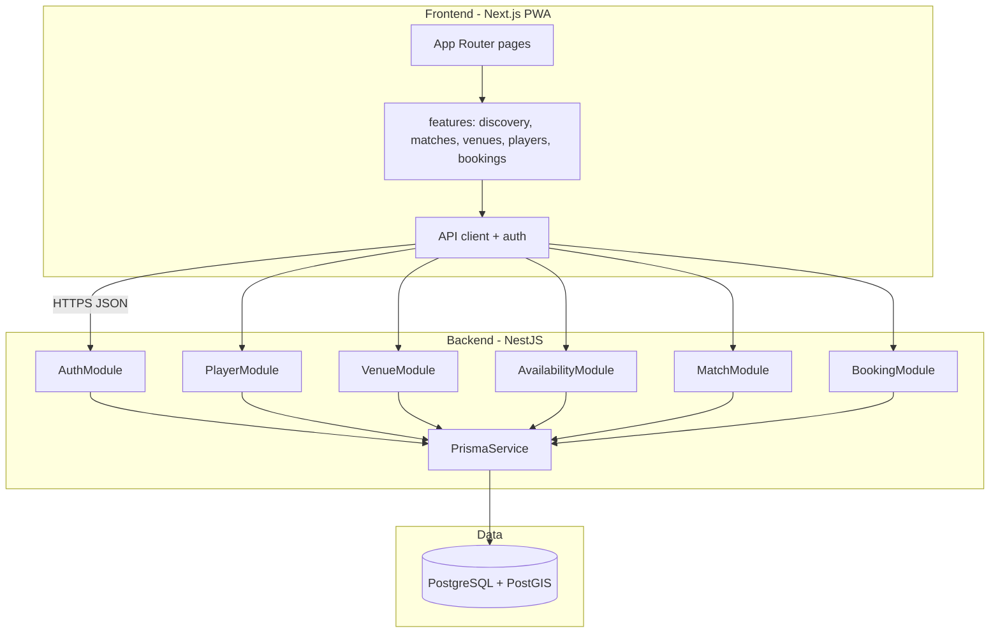

# Beach Tennis Matchmaking — Technical Specification

## Executive Summary

The MVP implements a balanced two-sided marketplace (ADR-001) as a **pnpm monorepo**: **NestJS** REST API with **PostgreSQL + Prisma + PostGIS**, and a **Next.js PWA** frontend. Venues publish court availability slots only; players create public or invite-only open matches, fill spots, and confirm **bookings** that reserve a venue slot. Authentication uses **JWT with single-role RBAC** (`player` | `venue_manager`).

**Primary trade-off:** TypeScript full stack and a separate API service maximize clarity of domain boundaries and speed of iteration, at the cost of two deployables and more initial scaffolding than a single Next.js app or a Go microservice split.

## System Architecture

### Component Overview



| Component | Responsibility | Boundary |
|-----------|----------------|----------|
| `AuthModule` | Register, login, refresh, JWT issuance, role guards | No business domain logic |
| `PlayerModule` | Player profile CRUD, skill level, location | Owns `PlayerProfile`; players only |
| `VenueModule` | Venue profile, courts metadata | Owns `Venue`, `Court`; venue managers only |
| `AvailabilityModule` | Publish/list/update availability slots | Supply side; slot lifecycle |
| `MatchModule` | Create/list/join/leave matches and spots; invite resolution | Demand side; no slot reservation |
| `BookingModule` | Link match to slot; confirm/cancel; prevent double booking | Transactional; coordinates match + slot |
| Next.js `features/*` | UX flows per PRD journeys | No direct DB access |

**Data flow (happy path):** Venue manager publishes slots → Player browses public matches or opens invite link → Player joins spot → Organizer creates booking against chosen slot → Booking confirmation marks slot `reserved` and match `booked`.

**External systems (MVP):** None required. Email sending (verification, booking confirmation) optional stub; implement as interface with console/log provider in MVP.

## Implementation Design

### Core Interfaces

Primary service contract for match lifecycle (NestJS provider + interface for testing):

```typescript
// backend/src/match/match.service.interface.ts
export type MatchFormat = 'singles' | 'doubles';
export type MatchVisibility = 'public' | 'invite';
export type MatchStatus = 'forming' | 'open' | 'ready_to_book' | 'booked' | 'cancelled';

export interface CreateMatchInput {
  format: MatchFormat;
  visibility: MatchVisibility;
  skillLevel: string; // e.g. beginner | intermediate | advanced
  latitude: number;
  longitude: number;
  notes?: string;
}

export interface IMatchService {
  create(userId: string, input: CreateMatchInput): Promise<MatchDto>;
  findPublicNearby(query: DiscoveryQuery): Promise<Paginated<MatchDto>>;
  findByInviteCode(code: string): Promise<MatchDto>;
  joinSpot(matchId: string, userId: string): Promise<MatchSpotDto>;
  leaveSpot(matchId: string, userId: string): Promise<void>;
}
```

Booking service contract (transactional boundary):

```typescript
// backend/src/booking/booking.service.interface.ts
export interface IBookingService {
  create(userId: string, matchId: string, availabilitySlotId: string): Promise<BookingDto>;
  confirm(bookingId: string, userId: string): Promise<BookingDto>;
  cancel(bookingId: string, userId: string): Promise<void>;
}
```

**Error convention:** NestJS `HttpException` with stable `code` in body (e.g., `SLOT_NOT_AVAILABLE`, `MATCH_FULL`, `FORBIDDEN`). Map Prisma unique violations to `409 Conflict`.

### Data Models

Prisma schema (conceptual; field types refined at implementation):

| Model | Key fields | Notes |
|-------|------------|-------|
| `User` | id, email, passwordHash, role, createdAt | role: `player` \| `venue_manager` |
| `PlayerProfile` | userId, displayName, skillLevel, location (geography), bio? | 1:1 User |
| `VenueManagerProfile` | userId, displayName | 1:1 User |
| `Venue` | id, managerId, name, address, location, description | managerId → User |
| `Court` | id, venueId, name, surface? | |
| `AvailabilitySlot` | id, courtId, startsAt, endsAt, status, priceCents? | status: `available` \| `reserved` \| `cancelled` |
| `Match` | id, creatorId, format, visibility, inviteCode?, skillLevel, location, status | inviteCode unique when invite |
| `MatchSpot` | id, matchId, playerId?, status, position | status: `open` \| `filled`; max spots from format |
| `Booking` | id, matchId, availabilitySlotId, status, createdById | unique(slotId) when status confirmed |

**Relationships:**
- Venue 1—N Court 1—N AvailabilitySlot
- Match 1—N MatchSpot; Match N—1 User (creator)
- Booking N—1 Match, N—1 AvailabilitySlot (1:1 slot reservation when confirmed)

**Player profile minimum (MVP):** displayName, skillLevel (enum), location (lat/lng or city + coordinates). Optional: bio (max 280 chars).

**Spatial:** Store `location` on Venue, Match discovery anchor, and PlayerProfile using PostGIS; discovery uses `ST_DWithin` with radius km from query params.

### API Endpoints

Base path: `/api/v1`. All authenticated routes require `Authorization: Bearer <access_token>` unless noted.

#### Auth

| Method | Path | Description |
|--------|------|-------------|
| POST | `/auth/register` | Body: email, password, role, profile fields → 201 |
| POST | `/auth/login` | → accessToken, refreshToken |
| POST | `/auth/refresh` | Refresh token → new accessToken |

#### Players

| Method | Path | Role | Description |
|--------|------|------|-------------|
| GET | `/players/me` | player | Current profile |
| PATCH | `/players/me` | player | Update profile |

#### Venues

| Method | Path | Role | Description |
|--------|------|------|-------------|
| POST | `/venues` | venue_manager | Create venue profile |
| GET | `/venues/me` | venue_manager | Own venue |
| PATCH | `/venues/:id` | venue_manager | Update own venue |
| POST | `/venues/:id/courts` | venue_manager | Add court |
| GET | `/venues/:id/courts` | any | List courts |

#### Availability

| Method | Path | Role | Description |
|--------|------|------|-------------|
| POST | `/venues/:id/availability-slots` | venue_manager | Publish slot |
| GET | `/availability-slots` | any | Query: lat, lng, radiusKm, from, to, status |
| PATCH | `/availability-slots/:id` | venue_manager | Cancel/update own |

#### Matches

| Method | Path | Role | Description |
|--------|------|------|-------------|
| POST | `/matches` | player | Create match |
| GET | `/matches` | any | Public discovery: lat, lng, radiusKm, format?, skillLevel? |
| GET | `/matches/invite/:code` | any | Resolve invite-only match |
| GET | `/matches/:id` | any | Detail + spots |
| POST | `/matches/:id/spots/join` | player | Join open spot |
| POST | `/matches/:id/spots/leave` | player | Leave spot |

#### Bookings

| Method | Path | Role | Description |
|--------|------|------|-------------|
| POST | `/bookings` | player | Body: matchId, availabilitySlotId → 201 pending |
| POST | `/bookings/:id/confirm` | player | Confirm (creator or policy: creator only in MVP) |
| DELETE | `/bookings/:id` | player | Cancel |

**Status codes:** 200/201 success, 400 validation, 401 unauthenticated, 403 wrong role/owner, 404 not found, 409 conflict (slot taken, match full).

## Integration Points

| Integration | MVP approach |
|-------------|----------------|
| Email | `IEmailSender` no-op or log implementation |
| Maps / geocoding | Client browser geolocation; server accepts lat/lng. Address geocoding Phase 2 |
| Payments | Out of scope (PRD non-goals) |

## Impact Analysis

| Component | Impact Type | Description and Risk | Required Action |
|-----------|-------------|---------------------|-----------------|
| `backend/` | new | NestJS app, all modules | Scaffold via Nest CLI, Prisma init |
| `frontend/` | new | Next.js PWA | Scaffold App Router, manifest, API client |
| `docker-compose.yml` | new | Local Postgres + PostGIS | Add at repo root |
| `.github/workflows` | new | CI lint/test/build | Add workflow on PR |
| `.compozy/tasks/.../adrs` | modified | ADR-002–006 added | Reference in tasks |

## Testing Approach

### Unit Tests

- **Framework:** Jest (NestJS default) + `@nestjs/testing` for module isolation.
- **Targets:** `MatchService` (spot limits singles=2, doubles=4), `BookingService` (double-book prevention), `RolesGuard`, invite code generation uniqueness.
- **Mocks:** Prisma client mock or in-memory SQLite **not** used (PostGIS); mock repository interfaces behind services.

### Integration Tests

- **Framework:** Supertest against `AppModule` with **Testcontainers PostgreSQL+PostGIS** (or dedicated test DB).
- **Scenarios:**
  1. Venue publishes slot → player creates public match → join → book → slot reserved.
  2. Invite match not returned in public `GET /matches`.
  3. Concurrent booking same slot → one 409.
- **Seed:** Factory helpers per model in `backend/test/factories/`.

## Development Sequencing

### Build Order

1. **Monorepo foundation** — pnpm workspace, Docker Compose Postgres/PostGIS, `.env.example`, root README. No dependencies.
2. **Backend scaffold + Prisma schema** — depends on step 1. User, PlayerProfile, Venue, Court models.
3. **AuthModule** — depends on step 2. Register/login/JWT, role guards.
4. **VenueModule + Court** — depends on step 3. Venue manager flows.
5. **AvailabilityModule** — depends on step 4. Slot publishing and listing.
6. **PlayerModule** — depends on step 3. Can parallel with 4–5 after auth.
7. **MatchModule** — depends on step 6. Create/join/leave, public + invite discovery.
8. **BookingModule** — depends on steps 5 and 7. Transactional confirm.
9. **Frontend auth + layout** — depends on step 3 API. Login/register by role.
10. **Frontend discovery + match flows** — depends on steps 7–8 APIs.
11. **Frontend venue slot publishing** — depends on step 5 API.
12. **PWA + polish** — depends on step 10. Manifest, service worker, mobile layout.
13. **CI pipeline** — depends on steps 2–8. Lint, unit tests, integration tests on PR.

### Technical Dependencies

- PostGIS-enabled PostgreSQL available locally (Docker) and in staging/prod.
- Launch geography: configure `DISCOVERY_DEFAULT_RADIUS_KM` and optional `LAUNCH_BOUNDS` env for soft geographic limit (answers PRD cold-start; default single metro).
- No third-party auth dependency for MVP.

## Monitoring and Observability

| Signal | MVP implementation |
|--------|---------------------|
| Metrics | Log-based counters later; optional Prometheus in Phase 2 |
| Logs | Structured JSON (pino): `requestId`, `userId`, `route`, `durationMs` |
| Key events | `match.created`, `spot.joined`, `booking.confirmed`, `slot.published` |
| Alerts | Manual for MVP; 5xx rate on staging |

**PRD metrics mapping:** Instrument booking confirm and spot join events for later analytics pipeline (Phase 2 venue insights).

## Technical Considerations

### Key Decisions

| Decision | Rationale | Trade-off |
|----------|-----------|-----------|
| NestJS modules per domain | Maps to PRD features, testable boundaries | More files than minimal Express |
| Prisma + PostGIS | Relational booking integrity + geo | Raw SQL for some geo queries |
| Single role per account | Simpler MVP auth | Two accounts if user is both player and manager |
| Slots-only venues | Low venue friction (PRD) | Players own match creation UX |
| Invite code matches | Supports partial groups without public listing | Must not leak invite matches in public index |

### Known Risks

| Risk | Mitigation |
|------|------------|
| Double booking | DB unique on `availabilitySlotId` for confirmed bookings; transaction in `BookingService.confirm` |
| Invite code enumeration | Use 128-bit random URL-safe token; rate limit invite endpoint |
| Cold start / empty discovery | Seed data; launch bounds; venue onboarding checklist in ops (not code) |
| PWA cache stale | Versioned SW; network-first for API routes |

### PRD Open Questions (resolved for MVP)

| Question | Resolution |
|----------|------------|
| Venue-hosted matches? | No — slots only (ADR-005) |
| Minimum player profile? | displayName, skillLevel, location |
| Private matches? | Invite-link only, not in public feed (ADR-005) |
| Geographic launch? | Configurable env bounds + default radius; single metro recommended operationally |

## Architecture Decision Records

- [ADR-001: Balanced Marketplace MVP Centered on Open Match Participation](adrs/adr-001.md) — Product scope: two-sided marketplace with open match participation as the core loop.
- [ADR-002: NestJS Backend with Next.js Frontend](adrs/adr-002.md) — TypeScript monorepo with NestJS REST API and Next.js App Router client.
- [ADR-003: PostgreSQL with Prisma and PostGIS](adrs/adr-003.md) — Relational DB with spatial queries and Prisma migrations.
- [ADR-004: JWT Authentication with Single-Role RBAC](adrs/adr-004.md) — JWT access/refresh with one role per account in MVP.
- [ADR-005: Venue Slots Only; Public and Invite-Only Matches](adrs/adr-005.md) — Separate availability, match, and booking entities; invite codes for non-public matches.
- [ADR-006: Mobile-First Web via Next.js PWA](adrs/adr-006.md) — Responsive web with PWA installability instead of native apps in MVP.
